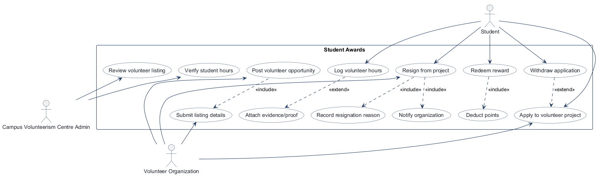
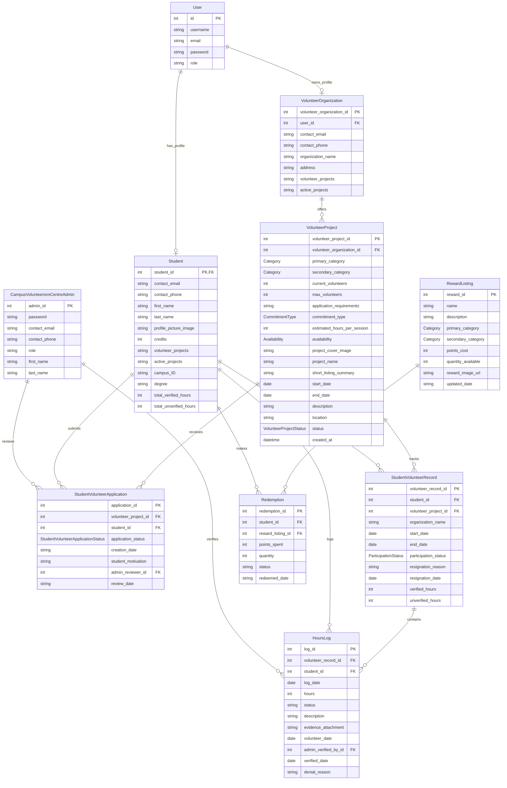
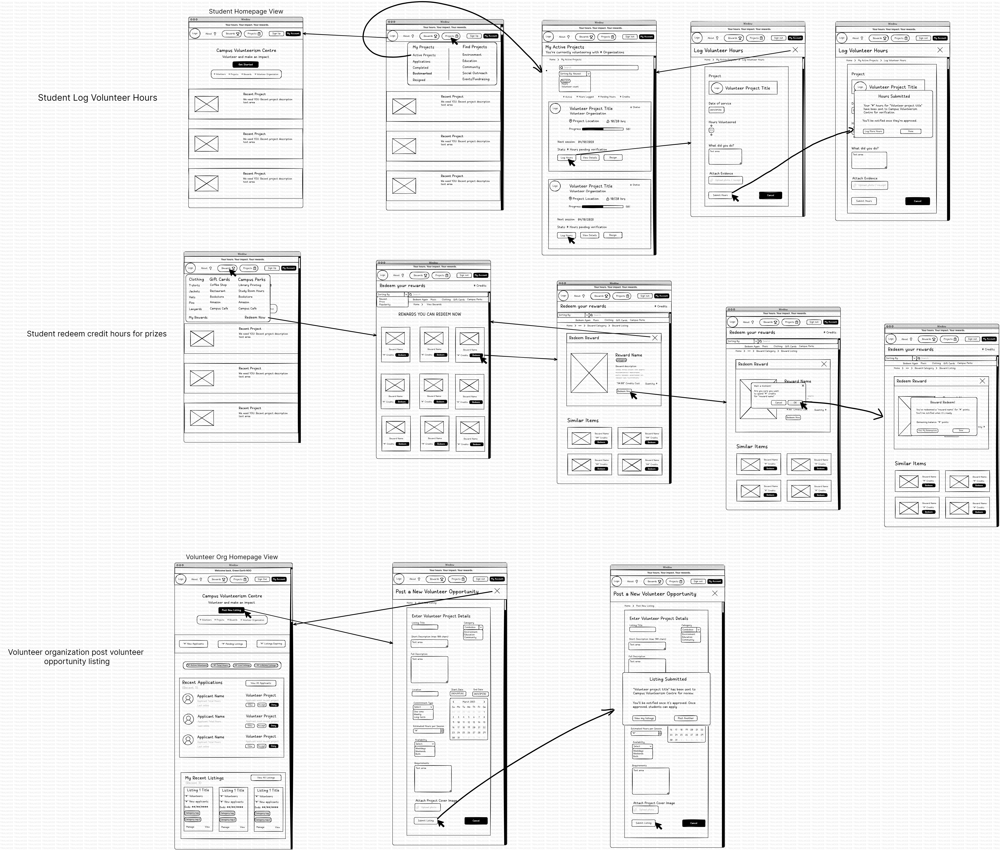

# COMP 3613 Assignment 1

Draft this file with the Guide. **Update it after every phase milestone** before you pause. The use-case diagram is a UML PNG at `docs/diagrams/use-case.png`, linked from this file as `diagrams/use-case.png` (path relative to `docs/report.md`). The model diagram is Mermaid. **Embed wireframe images** as `wireframes/<file>` (files live in `docs/wireframes/`).

Do not put your student ID in this file if you will commit it. The PDF cover adds your name and ID at export time.

## Assigned project
Student Awards

## Three workflows

### 1.
Log Volunteer Hours (Student)

### 2.
Post Volunteer Opportunity (Volunteer Organization)

### 3.
Redeem Hour Credits for Prizes (Student)

## Use case diagram

## Model diagram

First draft. Update this section in Phase 5 when polish revises the model, and note what changed.

Assumptions: Student and VolunteerProject are linked through StudentVolunteerApplication and StudentVolunteerRecord, with a separate HoursLog linked to each volunteer record. The admin is an independent actor that reviews applications and verifies logs.

`VolunteerProject.commitment_type` is an enum with values `one_time`, `weekly`, and `long_term`; `estimated_hours_per_session` is an integer.
`VolunteerProject.availability` is an enum with values `weekdays` and `weekends`.
`VolunteerProject.project_cover_image` stores the cover image reference (such as a URL or file path).
`VolunteerProject.status` is a `VolunteerProjectStatus` enum (`pending`, `approved`, `denied`); public search includes approved listings only. `VolunteerProject.created_at` supports the requested newest-first listing order.
`Student.profile_picture_image` stores the profile image reference (such as a URL or file path).
`StudentVolunteerApplication.application_status` is a `StudentVolunteerApplicationStatus` enum with `pending`, `approved`, and `denied` values.
Phase 5 identity mapping: the FastStarter `User` account and `Student` profile share the same ID; credentials remain on `User`.
`StudentVolunteerRecord.participation_status` is a `ParticipationStatus` enum with `active`, `completed`, and `resigned` values. Its `organization_name` is retained from the student's model snippet for the project-card design.
`Student` and `RewardListing` have a many-to-many relationship through `Redemption`, which records each redemption's points, quantity, status, and date. `Redemption.reward_listing_id` references `RewardListing.reward_id`. `Category` is a separate enum data type used by all category attributes; its values are not specified yet.

## Wireframes

### Log Volunteer Hours (Student)

### Post Volunteer Opportunity (Volunteer Organization)

### Redeem Hour Credits for Prizes (Student)

### Student applies to join a project (Phase 5 request)

### Admin dashboard (Phase 5 request)

<!-- student-build:wireframe-coverage
use_case: Log Volunteer Hours (Student)
image: docs/wireframes/Wireframe.jpg
covered: yes
-->

<!-- student-build:wireframe-coverage
use_case: Post Volunteer Opportunity (Volunteer Organization)
image: docs/wireframes/Wireframe.jpg
covered: yes
-->

<!-- student-build:wireframe-coverage
use_case: Redeem Hour Credits for Prizes (Student)
image: docs/wireframes/Wireframe.jpg
covered: yes
-->

<!-- student-build:wireframe-coverage
use_case: Student applies to join a project (Phase 5 request)
image: docs/wireframes/Student apply to project/Student apply to project wireframe.jpg
covered: yes
-->

<!-- student-build:wireframe-coverage
use_case: Review project listings and student applications and hours; view resignations (Admin)
image: docs/wireframes/admin view/admin view.jpg
covered: yes
-->

### Accepted model revisions
- Student.credits — seen on Wireframe.jpg
- HoursLog.status — seen on Wireframe.jpg
- StudentVolunteerRecord.verified_hours — seen on Wireframe.jpg
- VolunteerProject.max_volunteers — seen on Wireframe.jpg
- VolunteerProject.status and created_at — added in Phase 5 for reviewed public listings and newest-first ordering.
- StudentVolunteerApplication.student_motivation — shown on the student application wireframe; limited to 255 characters.
- StudentVolunteerApplication.application_status — modeled as a pending/approved/denied enum in Phase 5.
- RewardListing.points_cost — seen on Wireframe.jpg
- Redemption.status — seen on Wireframe.jpg

Accepted workflow completion: the student logs hours, the entry sits in a pending/admin-verification state, and only then does the approved total update the student’s credits.

## Theming

### StudentCare Volunteer Community

- Colors: deep navy `#1B3C53`, primary blue `#234C6A`, blue `#456882`, mint/aqua UI accents, and dark text with gray secondary text. Gold (`#F0A93F`, `#F7C883`) is reserved for reward UI.
- Type: DM Sans for headings and Montserrat for body text.
- Tone: “Effort is visible. Every hour counts.”
- Logo/wordmark: StudentCare Volunteer Community logo provided by the student.
- Applied: shared design tokens and type in `app/static/css/app.css`; the supplied logo is in `app/static/img/studentcare-logo.jpg`; public landing, login, register, and authenticated shell now use the StudentCare brand. Starter placeholder copy was removed from the authenticated workspace views; auth and `/config` remain.
- Wireframe review: the revised composite is legible; treat the student Active Projects/Log Hours path as the current workflow and the Rewards menu as a separate Redeem workflow. External annotation/watermark text is not interpreted as model data.

## Implementation notes

One named workflow at a time. Include verify notes and polish / model revisions (Phase 5). Do not treat the first build as final.

Theming is applied. Log Volunteer Hours is implemented. The student verified a submission and saw “Hours submitted for verification.” The idempotent seed provides Bob with an active record for Community Garden Crew, with service dates covering today.

- Active-project cards are drawn from the student's active `StudentVolunteerRecord` rows; an empty state appears when none exist.
- Submissions require a positive whole number of hours, a non-empty description, an active record owned by the student, and a service date within that record's dates and no later than today.
- New logs start in `pending`; credit totals remain unchanged until verification.
- The Student profile shares the authenticated `User.id`; regular-user creation initializes that profile.
- Evidence is optional; the current implementation accepts JPG/PNG/PDF up to 5 MB and stores files outside the public static directory.
- The `ParticipationStatus` enum and `StudentVolunteerRecord.organization_name` were added from the student's model edits. Date fields used for validation are represented as dates.
- Based on the student's Phase 5 steering, the authenticated shell uses a horizontal top navigation (no left sidebar), with Projects, Rewards, My Profile, and Log out. The Projects menu links to Active Projects; the student page itself continues to list only active projects.
- Based on the student's Phase 5 steering, the home page has a centered welcome banner, a Get Started link to `/projects`, and a scrollable newest-approved-projects section. The organization logo/name is in the horizontal navigation.
- Student-requested polish on My Active Projects adds live stats for active projects, total submitted hours (including pending submissions), pending hours, and credits, plus a search by project/organization/location and newest, logged-hours, or volunteer-count sorting. This update awaits student verification.
- Further student-requested polish adds a View Details link on each active-project card and a confirmation modal for resigning. Students may provide an optional reason; resignation records its date and status, preserves the participation and hours history, and decrements the project's current volunteer count to free the spot. This update awaits student verification.
- A public project-search/listing page and the home page's newest approved listings were added at the student's request. Text and category searches are handled through the service/repository layers. Rewards navigation now links to the category-filtered reward catalog and the student's redemption history.
- Existing `volunteer_project` tables receive an additive startup migration for the approval status and listing timestamp; it preserves existing rows.
- The `init`/`seed` commands now create 3 sample volunteer organizations and 10 approved projects (distributed 4/3/3), with upcoming dates so they appear in public search. `Digital Skills for Seniors` is designated as a full-capacity test project; rerunning `python manage.py seed` updates that existing sample row without dropping data.
- The new public home, navigation, profile link, and project-search flow await student-run UI verification.
- Student verification: public project search opens correctly, though the existing database had no listings before the updated seed data was added. Student requested a visible StudentCare wordmark beside the logo and revised hero hierarchy; the logo/name and updated title/tagline sizing are now in the top navigation and landing hero.
- Fixed a landing-page `NoMatchFound` error: a project name is now encoded into the `/projects` query string instead of being passed as an undeclared path parameter.
- Post Volunteer Opportunity (Volunteer Organization) is implemented and awaits student verification. Volunteer organization accounts reuse FastStarter `User` login credentials; each account is linked one-to-one to a `VolunteerOrganization` profile. The service maps the authenticated user ID to the organization profile ID before creating a pending listing. The dashboard shows the organization’s own listings and summary counts; the form includes the wireframe fields plus the student-requested maximum-volunteer capacity. Uploaded cover images are served from a dedicated public cover-image directory, separate from private hour evidence.

Student-requested project application workflow is implemented and student-verified. The added wireframe covers project details, a motivation field, submission, and a confirmation with links to browse projects or start another application. The student chose one application per student/project, service-coordinated duplicate rejection, and rejection when the project is full. Applications are pending review; only approved, unexpired, non-full projects accept new applications. The application form limits motivation to 255 characters.

Polish: project details and application pages now hide/block applications for students with an active volunteer record or an approved application for that project. The service also enforces this check on submission, so direct POSTs cannot bypass it.

Student verification: the initial application succeeded and a second attempt for the same student/project was rejected with “Student has already applied to this project.” After running `python manage.py seed`, `Digital Skills for Seniors` displayed as full, hid the Apply Now button, and showed the capacity-block message when the student opened its `/apply` route directly.

Polish requested: always show a project-cover area when a project has no cover image, move Apply Now / Back to Projects between commitment type and About, and restore “Ready to join?” as the motivation form heading. A reusable StudentCare-branded SVG cover now appears on the homepage, project listings, and details page whenever no project-specific cover is present. Student confirmed the cover and application-page polish look right.

The student requested homepage “View Project” links to open project details directly instead of routing through search. Student verification confirmed the link opens the corresponding project detail page.

Admin dashboard is the current Phase 5 workflow, guided by `wireframes/admin view/admin view.jpg`. It includes pending project listings, pending student applications, pending hour logs, and recent resignations. The student chose detail-page review for hour logs, with an optional denial reason, and 25 credits per approved hour. Accepting a student application creates an active participation and increments the project's volunteer count.

The dashboard, pending queues, listing/application/hour detail pages, review actions, private evidence download, and resignation history are implemented through routes → services → repositories. Reviews reject repeat decisions; application acceptance checks listing approval and capacity, while hour review updates pending/verified totals and credits in one transaction. The seed command provisions the admin profile needed to record reviewers. Local runs exposed ambiguous inferred joins in the pending-application and pending-hours queries; joins are now anchored to their source models, with the hour-log/participation link explicitly specified. Diagnostics for the changed Python files report no errors, and `git diff --check` passes. No automated test files were found.

Student verification: using the Bob and GreenEarth accounts, the student confirmed `/admin` loads and verified hour review, resignation history, pending application review, and pending listing review; all behaved as intended.

Further polish requested: students should be able to upload profile pictures from My Profile, and the admin should see those pictures while reviewing applications. The existing `Student.profile_picture_image` field is used; pictures accept verified JPG/PNG/WEBP files up to 5 MB, are stored outside the public static directory, and are served only to the owning student or an admin. Images are shown on the admin dashboard, application queue, and application detail page. The student verified that picture uploads and the admin display work.

Additional polish requested: show the student profile picture instead of the generic account icon in the organization’s Recent Applicants cards. This is implemented, and picture access is scoped to applicants for that organization’s own listings. Diagnostics report no errors and `git diff --check` passes. Student verification confirmed that profile pictures appear on Recent Applicants and that the organization sees only applicants for its own listings.

Additional polish requested: add an About button beside the StudentCare logo in the top navigation. The public About page describes StudentCare’s purpose for students, volunteer organizations, and the Campus Volunteerism Centre. Student verification confirmed the page works for all user types.

<!-- student-build:code-check
workflow: Admin dashboard approvals and resignation review
form: choice
layer: other
architecture_ok: yes
implement_confidence: 0.45
passed: yes
note: Chose detail-page review for hour logs and an optional reason for denial.
-->

<!-- student-build:code-check
workflow: Admin dashboard approvals and resignation review
form: choice
layer: service
architecture_ok: yes
implement_confidence: 0.52
passed: yes
note: Set the policy to award 25 credits per approved hour.
-->

<!-- student-build:code-check
workflow: Admin dashboard approvals and resignation review
form: choice
layer: service
architecture_ok: yes
implement_confidence: 0.56
passed: yes
note: Chose to create active participation and increment project volunteer count when accepting an application.
-->

<!-- student-build:code-check
workflow: Admin dashboard approvals and resignation review
form: mcq
layer: service
architecture_ok: yes
implement_confidence: 0.62
passed: yes
note: Correctly explained that the Service coordinates validation and delegates database changes to the Repository.
-->

<!-- student-build:code-check
workflow: Admin dashboard approvals and resignation review
form: snippet
layer: model
architecture_ok: yes
implement_confidence: 0.66
passed: yes
note: Added pending/approved/denied hour-log statuses with pending as the SQLModel default.
-->

<!-- student-build:code-check
workflow: Admin dashboard approvals and resignation review
form: snippet
layer: router
architecture_ok: yes
implement_confidence: 0.76
passed: yes
note: Completed a thin admin approval route that delegates to the review service without database logic.
-->

Redeem Hour Credits for Prizes is implemented. The student chose immediate credit and inventory updates at confirmation, and correctly identified the Service as coordinating the redemption decision. `RewardListing` and `Redemption` follow the ERD, including the student's positive `Redemption.quantity` field. Students can search, filter by category, sort, redeem a selected quantity after a confirmation modal, see the updated balance, and review past redemptions. The service validates student profile, quantity, reward existence, available stock, and credit balance; repository operations persist the redemption and balance/stock updates in one transaction.

The seed command adds nine rewards across Clothing, Gift Cards, and Campus Perks. Bob receives 500 demo credits if his balance is zero and he has no prior redemption; seeding does not replenish spent credits once a redemption exists.

Initial `python manage.py init --no-drop` verification hit an existing-table compatibility issue: an older `redemption` table lacked `quantity`. Added a narrow additive migration with a default quantity of one for existing rows. The student reran `python manage.py init --no-drop`; migration and reward seeding completed successfully. The student verified the rewards flow and reported it works as expected, then identified a quantity-control polish issue: over-budget quantities disabled confirmation rather than capping the selector. The selector now caps at the lower of available stock and the affordable quantity, and is disabled if even one item is unaffordable. The student confirmed this polish works as expected.

Post Volunteer Opportunity implementation choices: organization credentials reuse FastStarter authentication and organization accounts are provisioned through seed/setup data. The student chose to collect maximum volunteer capacity on the form because that field already exists in the ERD and controls application availability; the student plans to add it to the wireframe. Existing organization profile passwords were removed from the model and are dropped by the compatibility migration; credentials remain on `User`. `VolunteerOrganization.user_id` links to `User.id`, and `VolunteerProject.short_listing_summary` stores the card summary (maximum 200 characters).

The workflow is available through seeded organization accounts: `greenearth` / `orgpass`, `campuspantry` / `orgpass`, and `learningnetwork` / `orgpass`. Submissions are validated by the service and saved as `pending` for Centre review. Invalid date ranges, past start dates, missing required content, non-positive session hours/capacity, or a missing organization profile are rejected. During the first student run, the student corrected a missing `date` import; the dashboard traceback then exposed that persisted project statuses arrive as strings, so status rendering now normalizes either string or enum values. The dashboard now includes new-applicant, pending-listing, and expiring-listing counters; active volunteers, total hours, new listings (last 30 days), and lifetime listings; recent applicant cards with read-only details; and an owner-only listing detail page. Applicant decisions remain with Campus Volunteerism Centre, per the existing application workflow. The form marks missing/invalid required fields red and preserves submitted values after service validation errors; if the end date precedes the start date, it clears only the end-date field. The student verified that only the end date clears on that error and that the form visibly warns when the cover image must also be reselected. A subsequent student check found an empty optional upload was treated as a selected file; the route now skips upload processing when no filename is provided. The student now reports the organization workflow dashboard is finished.

Dashboard polish limits the recent listing and applicant sections to four entries and adds organization-scoped “View All Listings” and “View All Applicants” pages. The full listing/applicant queries remain newest-first; the applicant page is read-only and includes application details. The student verified the applicant layout and reported the organization workflow dashboard is finished. The optional empty-upload fix was implemented after the student's report of the issue.

To make the applicant dashboard verifiable, the idempotent seed now provisions three sample student accounts and pending applications across two available seeded projects per organization. Seeded applications have recent timestamps and are skipped when the student/project pair already exists. This adds demo-only entries to the seeded organization listings; dashboard/page behavior still awaits student verification.

Student feedback: the applicant cards showed three columns with four recent records, leaving a single card alone in the final row. The shared applicant-card grid now uses two columns at large breakpoints, matching the listings grid; the student confirmed the layout is fixed.

Student requested required-field markers on the new listing form. Added a red asterisk after each required field label and a short legend; optional fields remain unmarked.

Student requested applicant counts on each recent listing card. Pending (awaiting Centre review) application counts are now queried per project in one grouped repository query and shown on listing cards; the same shared card displays the count on the all-listings page.

Student chose to allow permanent listing deletion only when there are no applications or volunteer records. Listing cards now provide a confirmed delete action; the organization-scoped service checks the dependencies before the repository deletes, and the associated cover image is removed after a successful deletion.

Student requested a visible warning card rather than the browser's native JavaScript confirmation. Replaced the native confirm with a Bootstrap modal warning that names the listing, explains permanent deletion and the dependency restriction, and offers explicit Cancel and Delete Listing actions.

Student clarified the warning should say “Delete this listing permanently?” rather than inserting the listing name into that sentence. Listing cards now use that generic confirmation text. They also show a disabled grey Delete Listing button with an explanation when any application (not only pending) or volunteer record exists; the service-side deletion guard remains authoritative.

Student reported that the signed-in organization account saw “Sign in to browse rewards.” Since reward browsing and redemption require a student profile, the Rewards dropdown now tells signed-in non-students that rewards are for student accounts instead of presenting a sign-in link.

Student requested four community-stat tags under the landing page's Get Started button. Added live totals for unique students with volunteer records, all project listings, reward listings, and volunteer organizations.

Skips: 0/3 used. The interrupted response was caused by the missing input box; no question was skipped.

<!-- student-build:code-check
workflow: Post Volunteer Opportunity (Volunteer Organization)
form: choice
layer: other
architecture_ok: yes
implement_confidence: 0.78
passed: yes
note: Chose to reuse FastStarter accounts and provision organization accounts through seed/setup data.
-->

<!-- student-build:code-check
workflow: Post Volunteer Opportunity (Volunteer Organization)
form: choice
layer: other
architecture_ok: yes
implement_confidence: 0.78
passed: yes
note: Chose a form field for max_volunteers because the existing model and wireframe flow require listing capacity.
-->

<!-- student-build:code-check
workflow: Post Volunteer Opportunity (Volunteer Organization)
form: choice
layer: other
architecture_ok: yes
implement_confidence: 0.78
passed: yes
note: Chose read-only applicant cards because Campus Volunteerism Centre owns application review.
-->

<!-- student-build:code-check
workflow: Post Volunteer Opportunity (Volunteer Organization)
form: mcq
layer: service
architecture_ok: yes
implement_confidence: 0.78
passed: yes
note: Identified the service as the owner of rejecting an end date earlier than the start date.
-->

<!-- student-build:code-check
workflow: Post Volunteer Opportunity (Volunteer Organization)
form: mcq
layer: service
architecture_ok: yes
implement_confidence: 0.78
passed: yes
note: Explained that the service maps the account ID to the organization profile ID before repository persistence.
-->

<!-- student-build:code-check
workflow: Post Volunteer Opportunity (Volunteer Organization)
form: snippet
layer: model
architecture_ok: yes
implement_confidence: 0.78
passed: yes
note: Added the User foreign key and short listing summary to the SQLModel; aligned the FK to User.id after review.
-->

<!-- student-build:code-check
workflow: Post Volunteer Opportunity (Volunteer Organization)
form: snippet
layer: router
architecture_ok: yes
implement_confidence: 0.78
passed: yes
note: Added a thin POST handler binding form values and delegating listing creation to VolunteerProjectService.
-->

<!-- student-build:code-check
workflow: Post Volunteer Opportunity (Volunteer Organization)
form: snippet
layer: repository
architecture_ok: yes
implement_confidence: 0.78
passed: partial
note: Implemented organization lookup and listing persistence; guide removed broad exception conversion that obscured database errors.
-->

<!-- student-build:code-check
workflow: Post Volunteer Opportunity (Volunteer Organization)
form: snippet
layer: service
architecture_ok: yes
implement_confidence: 0.78
passed: partial
note: Implemented date/content/capacity validation; guide aligned the listing FK to the resolved profile ID rather than the user ID.
-->

<!-- student-build:code-check
workflow: Redeem Hour Credits for Prizes (Student)
form: snippet
layer: model
architecture_ok: yes
implement_confidence: 0.66
passed: yes
note: Added Redemption.quantity as an integer with a minimum of one.
-->

<!-- student-build:code-check
workflow: Redeem Hour Credits for Prizes (Student)
form: snippet
layer: router
architecture_ok: yes
implement_confidence: 0.54
passed: partial
note: Calls the service without SQL and redirects; integration added success feedback and corrected the invalid alert severity.
-->

<!-- student-build:code-check
workflow: Redeem Hour Credits for Prizes (Student)
form: snippet
layer: repository
architecture_ok: yes
implement_confidence: 0.46
passed: partial
note: Persists the redemption and updates credits/stock; missing key guards and rollback handling will be integrated.
-->

<!-- student-build:code-check
workflow: Redeem Hour Credits for Prizes (Student)
form: snippet
layer: service
architecture_ok: yes
implement_confidence: 0.40
passed: partial
note: Added quantity, stock, student-profile, and sufficient-credit checks; integration aligned the return shape for the success modal and removed the TODO.
-->

<!-- student-build:code-check
workflow: Redeem Hour Credits for Prizes (Student)
form: choice
layer: other
architecture_ok: yes
implement_confidence: 0.62
passed: yes
note: Chose immediate credit deduction and inventory decrement when the student confirms redemption.
-->

<!-- student-build:code-check
workflow: Redeem Hour Credits for Prizes (Student)
form: mcq
layer: service
architecture_ok: yes
implement_confidence: 0.66
passed: yes
note: Correctly identified the Service to coordinate the redemption decision.
-->

<!-- student-build:code-check
workflow: Student applies to join a project (Phase 5 request)
form: snippet
layer: model
architecture_ok: yes
implement_confidence: 0.62
passed: yes
note: Added the ERD's student_motivation field and chose an application-status enum; the TODO was removed during integration.
-->

<!-- student-build:code-check
workflow: Student applies to join a project (Phase 5 request)
form: snippet
layer: router
architecture_ok: yes
implement_confidence: 0.58
passed: partial
note: Delegates submission to the service without SQL; integration corrected the optional ID handling path and invalid redirect target.
-->

<!-- student-build:code-check
workflow: Student applies to join a project (Phase 5 request)
form: snippet
layer: service
architecture_ok: yes
implement_confidence: 0.48
passed: partial
note: Added required motivation, approved-project, and duplicate checks through repository methods; corrected a project-status attribute mismatch on review.
-->

<!-- student-build:code-check
workflow: Student applies to join a project (Phase 5 request)
form: snippet
layer: repository
architecture_ok: yes
implement_confidence: 0.42
passed: yes
note: Implemented project lookup through the repository; the first attempt targeted the application table and was corrected to VolunteerProject.
-->

<!-- student-build:code-check
workflow: Student applies to join a project (Phase 5 request)
form: choice
layer: service
architecture_ok: yes
implement_confidence: 0.50
passed: yes
note: Chose to reject applications when a project reaches its volunteer limit.
-->

<!-- student-build:code-check
workflow: Log Volunteer Hours (Student)
form: choice
layer: other
architecture_ok: yes
implement_confidence: 0.78
passed: yes
note: Chose to include Rewards navigation in the student shell now while deferring reward actions to the separate Redeem workflow.
-->

<!-- student-build:code-check
workflow: Public project search/listing (Phase 5 student request)
form: choice
layer: other
architecture_ok: yes
implement_confidence: 0.62
passed: yes
note: Requested public project search/listing as part of the home-page Get Started flow.
-->

<!-- student-build:code-check
workflow: Public project search/listing (Phase 5 student request)
form: choice
layer: service
architecture_ok: yes
implement_confidence: 0.68
passed: yes
note: Chose to show approved/active listings only, hiding pending review entries.
-->

<!-- student-build:code-check
workflow: Public project search/listing (Phase 5 student request)
form: mcq
layer: service
architecture_ok: yes
implement_confidence: 0.72
passed: yes
note: Correctly chose the Service to coordinate interpretation of text/category search.
-->

<!-- student-build:code-check
workflow: Public project search/listing (Phase 5 student request)
form: snippet
layer: model
architecture_ok: yes
implement_confidence: 0.74
passed: yes
note: Added a pending-by-default status enum with approved, pending, and denied values; enum import was corrected during integration.
-->

<!-- student-build:code-check
workflow: Public project search/listing (Phase 5 student request)
form: snippet
layer: router
architecture_ok: yes
implement_confidence: 0.76
passed: yes
note: Bound query/category parameters and delegated to the service before rendering; no persistence logic in the route.
-->

<!-- student-build:code-check
workflow: Public project search/listing (Phase 5 student request)
form: snippet
layer: service
architecture_ok: yes
implement_confidence: 0.78
passed: yes
note: Normalized optional query/category input and delegated to the repository.
-->

<!-- student-build:code-check
workflow: Public project search/listing (Phase 5 student request)
form: choice
layer: model
architecture_ok: yes
implement_confidence: 0.8
passed: yes
note: Chose to add an explicit created_at timestamp for newest-first project listings.
-->

<!-- student-build:code-check
workflow: Log Volunteer Hours (Student)
form: snippet
layer: model
architecture_ok: yes
implement_confidence: 0.85
passed: yes
note: Added the HoursLog status column with a pending default.
-->

<!-- student-build:code-check
workflow: Log Volunteer Hours (Student)
form: choice
layer: other
architecture_ok: yes
implement_confidence: 0.45
passed: yes
note: Chose optional uploaded evidence with its stored path on HoursLog.
-->

<!-- student-build:code-check
workflow: Log Volunteer Hours (Student)
form: mcq
layer: service
architecture_ok: yes
implement_confidence: 0.65
passed: yes
note: Correctly placed active-record acceptance/rejection in the service.
-->

<!-- student-build:code-check
workflow: Log Volunteer Hours (Student)
form: open
layer: service
architecture_ok: yes
implement_confidence: 0.76
passed: yes
note: Described HTTP handling in the route, business rules in the service, and persistence through the repository.
-->

<!-- student-build:code-check
workflow: Log Volunteer Hours (Student)
form: choice
layer: other
architecture_ok: yes
implement_confidence: 0.82
passed: yes
note: Chose a Student profile keyed to the existing User ID.
-->

<!-- student-build:code-check
workflow: Log Volunteer Hours (Student)
form: snippet
layer: router
architecture_ok: yes
implement_confidence: 0.72
passed: partial
note: Called the service without SQL; raw session messaging and a non-existent redirect target needed integration correction.
-->

<!-- student-build:code-check
workflow: Log Volunteer Hours (Student)
form: choice
layer: service
architecture_ok: yes
implement_confidence: 0.76
passed: yes
note: Chose today or earlier as the allowed service-date range.
-->

<!-- student-build:code-check
workflow: Log Volunteer Hours (Student)
form: snippet
layer: service
architecture_ok: yes
implement_confidence: 0.62
passed: partial
note: Added date, ownership, active-participation, and positive-hours checks via repository calls; the service was aligned to the student's ParticipationStatus model and repository interface.
-->

## Deployed app

Phase 6. Public Render URL (not localhost). Markers open this to mark the three workflows.

https://

## Logins

Every account a marker needs, including extra users you added. Starter accounts:

- bob / bobpass — student (`regular_user`)
- applicant1 / applicantpass — student (`regular_user`)
- applicant2 / applicantpass — student (`regular_user`)
- applicant3 / applicantpass — student (`regular_user`)
- admin / adminpass — admin
- greenearth / orgpass — volunteer organization
- campuspantry / orgpass — volunteer organization
- learningnetwork / orgpass — volunteer organization

## YouTube URL

## Session transcripts

Filled when the Guide builds the report: the agent writes each Guide chat to `docs/transcripts/<slug>.md` (Copilot Agent, Cursor, or OpenCode). `python manage.py report` packages them. Do not paste chats here during the build.

## Competency (student-judge)

Filled when the report is built. Guide runs student-judge, writes `docs/judge.md`, and export appends the scorecard here.

## Skill integrity

Filled by `python manage.py report`. Do not edit the course skills.
