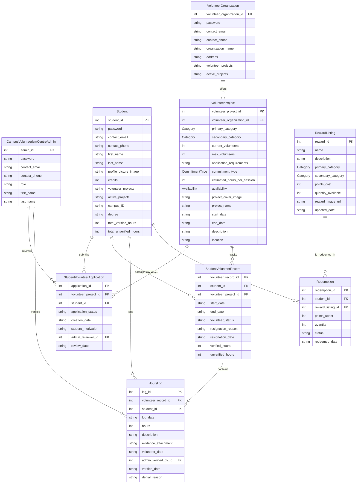

# COMP 3613 Assignment 1

Draft this file with the Guide. **Update it after every phase milestone** before you pause. The use-case diagram is a UML PNG at `docs/diagrams/use-case.png`, linked from this file as `diagrams/use-case.png` (path relative to `docs/report.md`). The model diagram is Mermaid. **Embed wireframe images** as `wireframes/<file>` (files live in `docs/wireframes/`).

Do not put your student ID in this file if you will commit it. The PDF cover adds your name and ID at export time.

## Assigned project
Student Awards

## Three workflows

### 1.
Log Volunteer Hours (Student)

### 2.
Post Volunteer Opportunity (Volunteer Organization)

### 3.
Redeem Hour Credits for Prizes (Student)

## Use case diagram

## Model diagram

First draft. Update this section in Phase 5 when polish revises the model, and note what changed.

Assumptions: Student and VolunteerProject are linked through StudentVolunteerApplication and StudentVolunteerRecord, with a separate HoursLog linked to each volunteer record. The admin is an independent actor that reviews applications and verifies logs.

`VolunteerProject.commitment_type` is an enum with values `one_time`, `weekly`, and `long_term`; `estimated_hours_per_session` is an integer.
`VolunteerProject.availability` is an enum with values `weekdays` and `weekends`.
`VolunteerProject.project_cover_image` stores the cover image reference (such as a URL or file path).
`Student.profile_picture_image` stores the profile image reference (such as a URL or file path).
`Student` and `RewardListing` have a many-to-many relationship through `Redemption`, which records each redemption's points, quantity, status, and date. `Redemption.reward_listing_id` references `RewardListing.reward_id`. `Category` is a separate enum data type used by all category attributes; its values are not specified yet.

## Wireframes

### Log Volunteer Hours (Student)

### Post Volunteer Opportunity (Volunteer Organization)

### Redeem Hour Credits for Prizes (Student)

<!-- student-build:wireframe-coverage
use_case: Log Volunteer Hours (Student)
image: docs/wireframes/Wireframe.jpg
covered: yes
-->

<!-- student-build:wireframe-coverage
use_case: Post Volunteer Opportunity (Volunteer Organization)
image: docs/wireframes/Wireframe.jpg
covered: yes
-->

<!-- student-build:wireframe-coverage
use_case: Redeem Hour Credits for Prizes (Student)
image: docs/wireframes/Wireframe.jpg
covered: yes
-->

### Accepted model revisions
- Student.credits — seen on Wireframe.jpg
- HoursLog.status — seen on Wireframe.jpg
- StudentVolunteerRecord.verified_hours — seen on Wireframe.jpg
- VolunteerProject.max_volunteers — seen on Wireframe.jpg
- RewardListing.points_cost — seen on Wireframe.jpg
- Redemption.status — seen on Wireframe.jpg

Accepted workflow completion: the student logs hours, the entry sits in a pending/admin-verification state, and only then does the approved total update the student’s credits.

## Theming

Branding preferences and how they were applied (landing / login / register).

## Implementation notes

One named workflow at a time. Include verify notes and polish / model revisions (Phase 5). Do not treat the first build as final.

## Deployed app

Phase 6. Public Render URL (not localhost). Markers open this to mark the three workflows.

https://

## Logins

Every account a marker needs, including extra users you added. Starter accounts:

- bob / bobpass — regular user
- admin / adminpass — admin

## YouTube URL

## Session transcripts

Filled when the Guide builds the report: the agent writes each Guide chat to `docs/transcripts/<slug>.md` (Copilot Agent, Cursor, or OpenCode). `python manage.py report` packages them. Do not paste chats here during the build.

## Competency (student-judge)

Filled when the report is built. Guide runs student-judge, writes `docs/judge.md`, and export appends the scorecard here.

## Skill integrity

Filled by `python manage.py report`. Do not edit the course skills.
